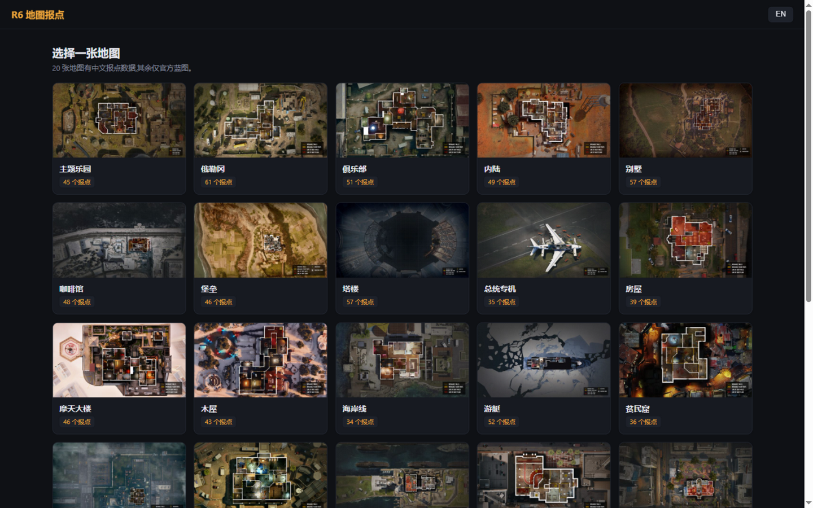
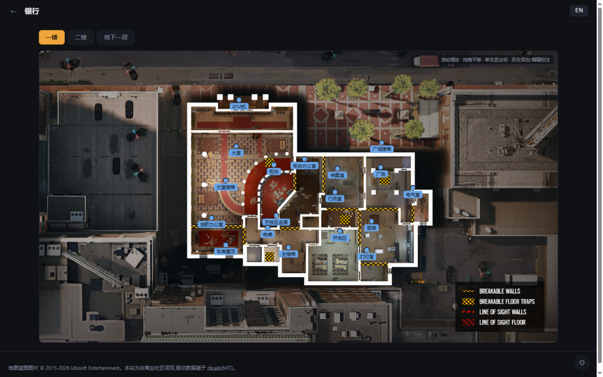

# R6地图 (r6map)

彩虹六号:围攻官方地图中文报点查询站。报点以「点位 + 名称」标注在育碧官方蓝图上,纯静态站点,无后端、无运行时依赖。

- 27 张官方地图,其中 20 张收录约 938 条中英文报点
- 全站中/英切换;个人标注保存于浏览器本地,可导出 JSON
- 构建期校验并预渲染为纯 HTML,可部署到任意静态托管(仓库自带 GitHub Actions 工作流)

## 效果图

首页:



地图页:



## 项目结构

```
r6map/
├── data/                       # 数据源
│   ├── floors.json             #   地图索引(楼层、蓝图 zip 来源、界面文案)
│   ├── callouts/<map>.json     #   报点数据,每图一个文件
│   ├── images/maps/<map>/      #   官方蓝图(由工具生成,勿手改)
│   ├── align_fixups.json       #   坐标对齐人工修正
│   └── sources.json            #   采集记录(工具维护,勿手改)
├── tools/                      # 构建与数据维护脚本(Python)
│   ├── build.py                #   校验 + 预渲染 → site/
│   ├── apply_contribution.py   #   合并导出JSON
│   ├── fetch_blueprints.py     #   下载官方蓝图 zip 入库
│   ├── import_r6calls.py       #   从 r6calls 导入英文报点名
│   ├── align_coords.py         #   SIFT 图像对齐 → 写入报点坐标
│   └── fetch_r6calls_imgs.py   #   下载 r6calls 对齐用图
├── templates/                  # Jinja2 页面模板
├── static/                     # 前端:app.js(原生 JS)+ style.css
├── docs/screenshots/           # README 效果图
└── .github/workflows/deploy.yml  # push main → 构建 → GitHub Pages
```

数据流水线:`data/*.json` → `tools/build.py`(校验 + 预渲染)→ `site/`(纯静态)。

## 使用方法

### 本地预览

```bash
pip install -r requirements.txt
python tools/build.py                    # 构建 → site/
python -m http.server -d site 8021      # 打开 http://127.0.0.1:8021
```

### 部署

push 到 `main` 后 GitHub Actions 自动构建并发布到 GitHub Pages。

### 地图页操作

| 操作 | 方式 |
|---|---|
| 缩放 / 平移 | 滚轮缩放(1–12x),放大后拖拽平移 |
| 查看坐标 | 单击任意位置,左下角显示百分比坐标 |
| 添加个人标注 | 双击地图,命名后保存于浏览器本地 |
| 编辑 / 删除 | 双击标注;或悬停标注点 × |
| 导出 / 导入 | 右下角 ⚙ 设置面板 |

## 贡献

接受的内容贡献为**报点点位与命名数据**,来源是网站上自建标注导出的 JSON:

1. 打开对应地图,双击添加标注并命名(也可拖拽修正已有报点位置)
2. 右下角 ⚙ → 设置 → 导出,得到如下结构的 JSON:

```json
{
  "overrides": { "<报点id>": { "x": 0.5, "y": 0.3, "zh": "更正名" } },
  "custom": [ { "id": "custom.xxx", "floor": "1F", "x": 0.4, "y": 0.6, "en": "Pin 1", "zh": "新点位" } ]
}
```

3. 通过 Issue 或 PR 提交该 JSON,注明地图与楼层;维护者使用下述命令一键合并。

**维护者合并**:

```bash
python tools/apply_contribution.py <地图> <json> [--dry-run]
```

脚本按 `overrides` 修正或删除已有报点、按 `custom` 追加新报点,自动校验楼层合法性与同层英文重名,无效条目跳过并逐条报告;新条目不带 `id`,合并后执行 `python tools/build.py --fix && python tools/build.py` 完成补齐与构建。建议先用 `--dry-run` 预览变更。

## 数据维护

| 命令 | 作用 |
|---|---|
| `python tools/build.py` | 校验数据并预渲染 → `site/` |
| `python tools/build.py --fix` | 补齐缺失报点 id 并回写后再构建 |
| `python tools/apply_contribution.py <地图> <json>` | 合并导出 JSON |
| `python tools/fetch_blueprints.py` | 下载官方蓝图 zip 入库 |
| `python tools/fetch_blueprints.py --check` | 对比官方 zip 哈希,检测地图重做 |
| `python tools/import_r6calls.py` | 从 [r6calls](https://github.com/DudeKiller82/r6calls)(MIT)导入英文报点名 |
| `python tools/align_coords.py` | SIFT 对齐自动写入报点坐标 |

### 新地图收录

收录流程含有必须人工确认的环节(目视核对 zip 内图片与楼层的对应、检查对齐质量、起译名),因此不做成一键脚本,按下面四步走:

1. 从[育碧地图页](https://www.ubisoft.com/en-us/game/rainbow-six/siege/game-info/maps)源码获取 `r6-maps-*.zip` 链接,在 `data/floors.json` 注册(`floors` 顺序 = zip 内图片序号,需目视确认;仅收录室内楼层)
2. `python tools/fetch_blueprints.py` 下载入库
3. `python tools/import_r6calls.py <地图>` 导入英文报点名(单图过滤,防覆盖其他图),`python tools/align_coords.py <地图>` SIFT 对齐写入坐标(数据源为 r6calls,前置文件见脚本 docstring)
4. 核对 `.cache/align/` 验证叠加图,补充 `zh` 译名,`python tools/build.py --fix && python tools/build.py` 预览后提交

已收录地图随赛季重做时:跑 `python tools/fetch_blueprints.py --check`,哈希变化即官方蓝图更新,重跑完整模式换图后人工核对该图 `callouts` 的报点增删。

## 版权

- 地图蓝图图片 © 2015-2026 Ubisoft Entertainment,本项目为非商业社区用途
- 英文报点数据基于 [DudeKiller82/r6calls](https://github.com/DudeKiller82/r6calls)(MIT)
